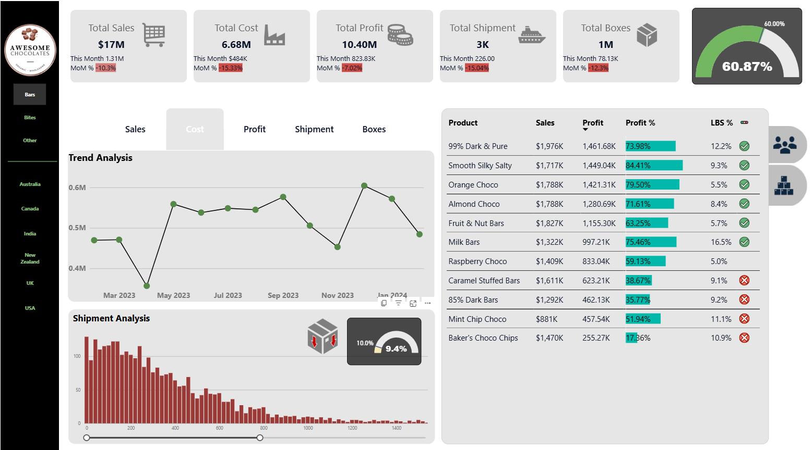
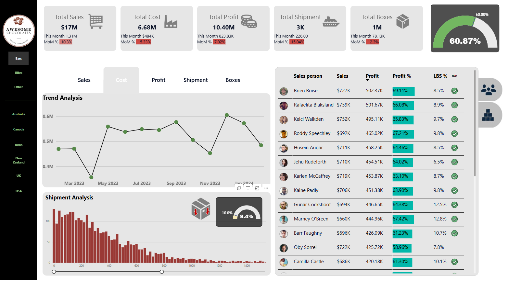

# 🛒 Retail Sales Performance Dashboard (Power BI)

A Power BI dashboard tracking **Sales, Cost, Profit %, Shipments**, and **trend analysis** with salesperson drilldowns and executive KPIs.

---

## 🔗 Live Dashboard
**Open in Power BI Service:** [App Powerbi Link](https://app.powerbi.com/reportEmbed?reportId=0899fff0-0cf6-41a2-9717-56ddbd4462e4&autoAuth=true&ctid=52d48b4c-a96a-4957-8557-71bd33686f3a)

---

## 📌 Highlights
- Executive tiles: **Total Sales**, **Total Cost**, **Total Profit**, **Total Shipment**
- **Profit % gauge** + **Trend Analysis** (MoM line)
- **Shipment Analysis** (bar + % labels)
- **Salesperson leaderboard** with performance metrics
- Clean navigation across “Sales / Profit / Shipment / Boxes”

---

## 🧩 How it’s built (Power BI)
- DAX measures for **Total Sales, Total Cost, Profit %, Shipments**
- Drill-through to salesperson view
- Consistent typography and executive-first layout

---

## 🖼️ Screenshots
**Page 1 – Executive Overview**  

**Page 2 – Salesperson / Drilldown**  

---

